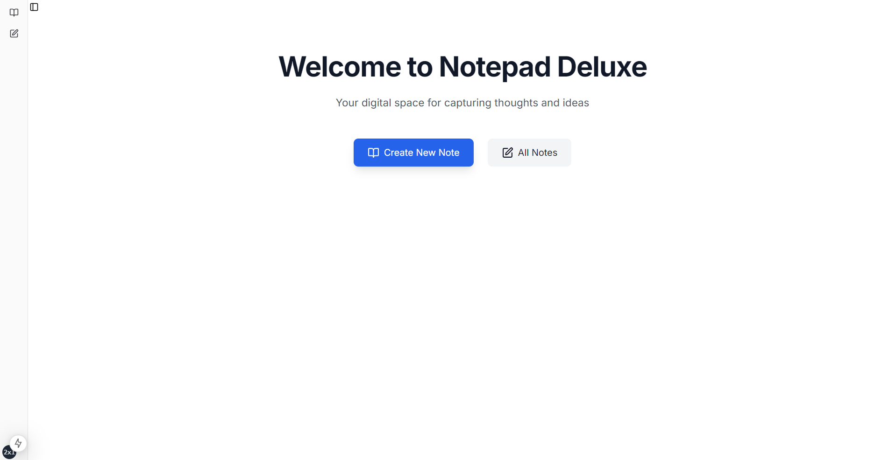
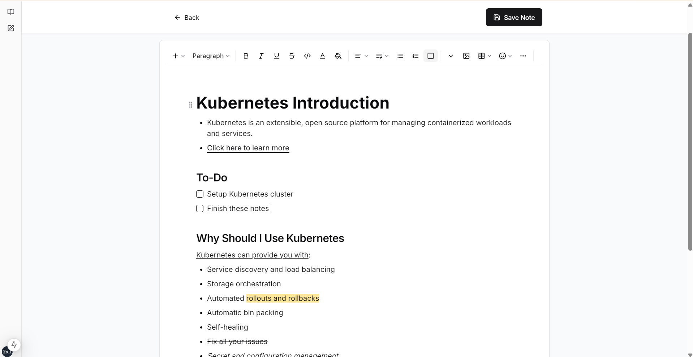

# Notepad Deluxe

## Introduction

A simple note-taking app with a rich text editor and a database.

## Features

- Rich text editor with plugins for formatting text.
- Database for storing notes.
- Cross-platform (Windows, MacOS, Linux).

## Setup

1. Clone the repository.
2. Install dependencies.
	- Use npm install
3. Run the app.
	- Use npm tauri dev

## Implementation

This project was built using Tauri, Next.js, Shadcn/UI, Lucide Icons, Tailwind CSS and SQLite.
